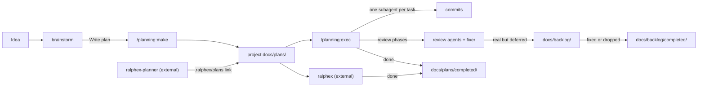
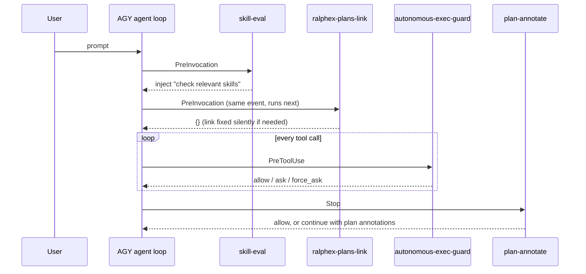

# cc-thingz for Antigravity / Jetski

A plugin suite for **Google Antigravity (AGY)** and its corporate variant **Jetski**: design brainstorming, structured planning, autonomous plan execution with multi-phase review, analytical thinking tools, and everyday workflow helpers.

This repository is a fork of [umputun/cc-thingz](https://github.com/umputun/cc-thingz), originally written for Claude Code. It keeps the ideas and much of the logic, with our customizations: every plugin is rebuilt as a native AGY plugin bundle, skills use AGY tools, hooks follow AGY's lifecycle contract, and several upstream parts are replaced or removed.

## Contents

- [What differs from upstream](#what-differs-from-upstream)
- [Install and update](#install-and-update)
- [How it fits together](#how-it-fits-together)
- [Plugins and skills](#plugins-and-skills)
- [Hooks](#hooks)
- [Where plans and backlog items live](#where-plans-and-backlog-items-live)
- [Custom rules](#custom-rules)
- [Repository layout](#repository-layout)
- [Testing](#testing)
- [Syncing with upstream](#syncing-with-upstream)

## What differs from upstream

| Area                  | Upstream (Claude Code)                                   | This fork (AGY / Jetski)                                                                                        |
| :-------------------- | :------------------------------------------------------- | :-------------------------------------------------------------------------------------------------------------- |
| Packaging             | `.claude-plugin/plugin.json`, marketplace install        | `plugin.json` at each plugin root, registered by `./install.sh` in `~/.gemini/config/plugins.json`              |
| Hooks                 | `hooks/hooks.json`, Claude hook events                   | `hooks.json` at the plugin root; AGY events `PreToolUse`, `PreInvocation`, `Stop`                               |
| Tools in skills       | `Agent`, `Bash`, `AskUserQuestion`, `Read`/`Write`/`Edit` | `invoke_subagent`, `run_command`, `ask_question`, `view_file`/`write_to_file`/`replace_file_content`           |
| Project overrides     | `.claude/`                                               | `.agents/`                                                                                                      |
| User data             | `$CLAUDE_PLUGIN_DATA`                                    | `~/.gemini/config/plugins_data/cc-thingz/`                                                                      |
| Rules file            | `CLAUDE.md`                                              | `AGENTS.md`                                                                                                     |
| Plans and backlog     | repository-level `docs/plans/`, `docs/backlog/`          | resolved per project, so monorepo sub-projects keep their own; closed backlog items are archived               |
| ralphex               | —                                                        | ralphex plans are routed into the project's `docs/plans/` by a hook                                            |
| Command approvals     | —                                                        | `autonomous-exec-guard` auto-approves safe tool calls and all calls from subagents and `/exec` runs             |
| Removed               | `release-tools`, `review:git-review`, `review:pr`, `thinking-tools:ask-codex` | `revmux` (a separate plugin) covers multi-agent code review                         |
| CI                    | GitHub Actions                                           | none — every check runs locally                                                                                 |

## Install and update

```bash
git clone <this-fork> ~/projects/cc-thingz
cd ~/projects/cc-thingz
./install.sh
```

`install.sh`:

- registers `<repo>/plugins` in `~/.gemini/config/plugins.json` and links each plugin into `~/.gemini/config/plugins/`;
- removes links in `~/.gemini/config/plugins/` that point at plugins no longer in the repository;
- removes the `autonomous-exec-guard` copy that older versions wrote into the global `~/.gemini/config/hooks.json` (the planning plugin registers it; with both present every tool call was checked twice). Other global hooks are left untouched.

Because the plugins are linked rather than copied, **pulling or editing the repository updates the installed plugins immediately** — there is no separate update step.

Skills can be switched off without deleting them:

```bash
./install.sh --list                                  # active and disabled skills
./install.sh --exclude "wiki-builder,dialectic"      # move to .disabled_skills/
./install.sh --restore all                           # bring them back
```

## How it fits together

The typical flow from idea to merged change, and where each artifact lands:



Hooks run at fixed points of every agent turn. Handlers of the same event from different plugins are merged and run one after another; they never override each other:



## Plugins and skills

Skills activate from natural-language triggers or explicitly as `/<plugin>:<skill>`.

### brainstorm

| Skill        | Triggers                                                        | What it does                                                                                                                                                                          |
| :----------- | :-------------------------------------------------------------- | :------------------------------------------------------------------------------------------------------------------------------------------------------------------------------------ |
| `brainstorm` | "brainstorm", "help me design", "think through", "explore options for" | Four-phase design dialogue: gather context and ask one question at a time → propose 2–3 approaches with a recommendation → present the design in validated sections → offer to write a plan, enter plan mode, or start. |

### planning

| Component                             | Triggers                                  | What it does                                                                                                                                                                                                 |
| :------------------------------------ | :---------------------------------------- | :----------------------------------------------------------------------------------------------------------------------------------------------------------------------------------------------------------- |
| `/planning:make` (command)            | "make a plan", `/planning:make <desc>`    | Gathers context, asks focused questions, explores approaches, and writes `docs/plans/yyyymmdd-<task>.md` with tasks, file lists, tests and progress checkboxes. Offers interactive review, auto review, or start. |
| `exec` (skill)                        | "exec", "execute plan", "run plan"        | Executes a plan task by task, one isolated subagent per task, optionally in a git worktree; then review phases (comprehensive, code smells, external, critical-only), optional finalize, stats, and moves the plan to `completed/`. Subagents never ask questions; judgment calls are reported at the end. |
| `plan-review` (agent)                 | "Auto review" in `/planning:make`         | Reviews a plan for problem definition, scope creep, over-engineering, testing and task granularity; verdict APPROVE or NEEDS REVISION.                                                                        |
| `autonomous-exec-guard` (hook)        | every tool call                           | See [Hooks](#hooks).                                                                                                                                                                                         |
| `plan-annotate` (hook)                | end of a turn that changed `implementation_plan.md` | See [Hooks](#hooks).                                                                                                                                                                               |
| `ralphex-plans-link` (hook)           | start of every turn                       | See [Hooks](#hooks).                                                                                                                                                                                         |

Configuration keys (`plans_dir`, review toggles, external review command, finalize) and prompt overrides are documented in [plugins/planning/references/usage.md](plugins/planning/references/usage.md). Interactive plan review uses `revdiff` when installed and falls back to `$EDITOR` in a terminal overlay; set `PLANNING_DISABLE_REVDIFF=1` to skip it.

### review

| Skill                        | Triggers                                        | What it does                                                                                                   |
| :--------------------------- | :---------------------------------------------- | :------------------------------------------------------------------------------------------------------------- |
| `code-review-best-practices` | "best practices review"                         | Structured review of a file or snippet: style, organization, error handling, testability, SOLID.               |
| `code-review-refactor`       | "refactor", "code smells"                       | Finds and executes refactorings that improve quality without changing behavior.                                |
| `writing-style`              | commit messages, PR/issue text, review comments | Direct, brief technical writing with no filler or AI-speak. Not used for README files or public docs.          |

Multi-agent review of branches and pull requests is done by **revmux**, a separate plugin installed alongside this suite.

### thinking-tools

| Skill                     | Triggers                                              | What it does                                                                                                         |
| :------------------------ | :---------------------------------------------------- | :------------------------------------------------------------------------------------------------------------------- |
| `dialectic`               | "dialectic", "prove/disprove", "argue both sides"     | Runs thesis and antithesis agents in parallel, then synthesizes a conclusion and verifies the cited evidence.        |
| `root-cause-investigator` | errors, failing builds or tests, "it's not working"   | 5-Why analysis from symptom to root cause, with reference patterns for races, resource exhaustion and integrations. |

### workflow

| Skill                   | Triggers                                         | What it does                                                                                                                                                            |
| :---------------------- | :----------------------------------------------- | :---------------------------------------------------------------------------------------------------------------------------------------------------------------------- |
| `backlog`               | "backlog", "add to backlog", "work the backlog"  | One file per deferred item in the project's `docs/backlog/`; verifies anchors, briefs each item, and on close adds `closed`/`outcome` and moves it to `docs/backlog/completed/`. |
| `learn`                 | "learn", "save knowledge", "capture learnings"   | Captures reusable project knowledge into the project's `AGENTS.md` / `GEMINI.md`, or a local override for per-developer facts.                                          |
| `clarify`               | "I don't understand", "why is this happening"    | Investigates the confusion against the real code and decides whether there is an actual issue.                                                                         |
| `wrong`                 | "wrong approach", "start over"                   | Re-analyzes the problem and proposes 2–3 fresh alternatives.                                                                                                           |
| `code-agentic-refactor` | structural refactors                             | AST-aware, surgical restructuring of code.                                                                                                                             |
| `wiki-builder`          | "build a wiki", "ingest documents"               | Processes a folder of PDFs, Markdown and images in parallel into an indexed `.wiki/` knowledge base.                                                                    |
| `md-copy`, `txt-copy`   | "copy as markdown", "copy to clipboard"          | Formats the answer or generated text and copies it to the clipboard.                                                                                                   |

### skill-eval

| Component           | When           | What it does                                                                                                              |
| :------------------ | :------------- | :------------------------------------------------------------------------------------------------------------------------ |
| `skill-eval` (hook) | every turn     | Injects the "MANDATORY SKILL ACTIVATION" instruction so the agent checks and reads relevant `SKILL.md` files before acting. |

### agterm-ide-launcher

A keyboard shortcut for the **agterm** terminal (`ctrl+shift+e` by default) that opens the current session's project in Antigravity IDE after a native Yes/No picker. See [plugins/agterm-ide-launcher/README.md](plugins/agterm-ide-launcher/README.md).

### Project skill: cc-thingz-sync

`.agents/skills/cc-thingz-sync/` is available only inside this repository. It rebases the fork on `umputun/cc-thingz` while preserving the AGY adaptations — see [Syncing with upstream](#syncing-with-upstream).

## Hooks

| Hook                    | Plugin     | Event           | Behavior                                                                                                                                                                                                                              |
| :---------------------- | :--------- | :-------------- | :------------------------------------------------------------------------------------------------------------------------------------------------------------------------------------------------------------------------------------ |
| `autonomous-exec-guard` | planning   | `PreToolUse`    | Tier 1: auto-approves read-only commands, test runners, and writes inside the workspace, `/tmp` or scratch. Tier 2: approves everything from subagents and active `/exec` runs. Tier 3: always asks for `git push`, `sudo`, `rm -rf /`, `curl \| bash`. Audit log: `/tmp/cc-thingz-hook-audit.jsonl`. |
| `plan-annotate`         | planning   | `Stop`          | When `implementation_plan.md` changed, opens it in `revdiff` (or `$EDITOR`) for line-by-line annotations and sends them back as a revision request.                                                                                   |
| `ralphex-plans-link`    | planning   | `PreInvocation` | Links the nearest existing `.ralphex/plans` to the project's `docs/plans` (see below). Silent; always returns `{}`.                                                                                                                  |
| `skill-eval`            | skill-eval | `PreInvocation` | Injects the skill-activation instruction.                                                                                                                                                                                             |

How hooks coexist:

- AGY merges the hooks of every plugin (and the global `~/.gemini/config/hooks.json`) and runs all handlers of one event **in sequence** — a new hook never replaces an existing one.
- Different events never interact: the command-approval hook (`PreToolUse`) and the `PreInvocation` hooks run at different points of the turn.
- Hook names must be unique across plugins; `tests/test-hooks-json.sh` enforces this together with placement, event structure and output shape.
- Every hook sets a timeout and exits 0 with valid JSON even on bad input, because a hook blocks the turn while it runs.
- Any hook can be switched off with `"enabled": false` on its entry.

## Where plans and backlog items live

Plans and backlog items belong to the project the agent was started in. `resolve-project-dir.sh` picks the project root as the nearest directory — walking up from the working directory and never past the VCS root — that holds `AGENTS.md`, `GEMINI.md`, `.agents/` or the target folder itself; with no match it uses the VCS root.

| Artifact              | Location                                    |
| :-------------------- | :------------------------------------------ |
| Active plans          | `<project>/docs/plans/`                     |
| Finished plans        | `<project>/docs/plans/completed/`           |
| Open backlog items    | `<project>/docs/backlog/`                   |
| Closed backlog items  | `<project>/docs/backlog/completed/`         |

A monorepo sub-project with its own `AGENTS.md` therefore keeps its own plans and backlog; a plain repository gets them at its root from anywhere inside it.

### ralphex plans

The external [ralphex](https://github.com/umputun/ralphex) tool's `ralphex-planner` skill always saves to `.ralphex/plans/`, and ralphex archives a finished plan into `completed/` next to it. The `ralphex-plans-link` hook makes the nearest existing `.ralphex/plans` a relative symlink to `<project>/docs/plans`, so ralphex plans follow the same layout — with no change to ralphex or its skills.

- It never creates `.ralphex/`, never re-points an existing link, and never touches a `.ralphex/plans/` that already holds files. Existing plans stay where they are; the link appears once that directory is empty or gone.
- Git refuses to stage a path through a symlink, so ralphex's own "move completed plan" commit does not happen; the archived plan stays in `docs/plans/completed/` for you to commit with your change.

## Custom rules

The **planning** and **brainstorm** plugins load free-form Markdown rules at invocation time and apply them alongside their built-in behavior. The first non-empty file wins; files are never merged.

1. Project: `.agents/<rules-file>.md` in the working directory
2. User: `~/.gemini/config/plugins_data/cc-thingz/<rules-file>.md`

| Plugin     | Rules file            | Affects                   |
| :--------- | :-------------------- | :------------------------ |
| planning   | `planning-rules.md`   | make, exec, plan-review   |
| brainstorm | `brainstorm-rules.md` | brainstorm                |

Example `.agents/planning-rules.md`:

```markdown
## testing conventions
- use table-driven tests
- mock external dependencies

## plan structure preferences
- max 5 checkboxes per task
- always include rollback steps for migrations
```

Ask `/planning:make` or `brainstorm` to show, add or clear rules at either level (for example "show my planning rules" or "clear user-level brainstorm rules").

## Repository layout

```text
.
├── AGENTS.md                     # rules for agents working in this repo (the only rules file)
├── .agents/skills/cc-thingz-sync # project-only skill: upstream sync
├── install.sh                    # registers and links the plugins
├── plugins/
│   ├── brainstorm/
│   ├── planning/                 # commands/, skills/exec/, agents/, scripts/, hooks.json
│   ├── review/
│   ├── thinking-tools/
│   ├── workflow/
│   ├── skill-eval/               # hooks.json + skill-forced-eval-hook.sh
│   └── agterm-ide-launcher/
├── tests/                        # shell suites, run locally
├── docs/plans/, docs/backlog/    # this repo's own plans and backlog
└── CHANGELOG.md                  # upstream history up to the fork
```

## Testing

All checks run locally; there is no remote CI.

```bash
for t in tests/test-*.sh; do bash "$t" || echo "FAIL: $t"; done
python3 plugins/planning/scripts/autonomous-exec-hook.py --test
python3 plugins/planning/scripts/ralphex-plans-link-hook.py --test
python3 .github/scripts/check-frontmatter.py .          # needs PyYAML
```

`tests/test-autonomous-exec-replay.py` (run by `test-autonomous-exec-hook.sh`) replays real transcripts through the guard. The conversation IDs are machine-specific, so they live outside the repository in `~/.gemini/config/plugins_data/cc-thingz/replay-conversations.json` (override with `CC_THINGZ_REPLAY_CONFIG`); without that file the replay is skipped:

```json
{
  "workspacePaths": ["/abs/path/to/workspace"],
  "subagents": ["<subagent conversation id>"],
  "parents": ["<interactive conversation id that must not be classified as a subagent>"],
  "replayParents": ["<interactive conversation id whose tool calls are replayed too>"]
}
```

## Syncing with upstream

Ask the agent to sync with upstream in this repository; the `cc-thingz-sync` skill fetches `umputun/cc-thingz`, rebases, and resolves conflicts in favor of the AGY adaptations. It always discards upstream's `plugins/release-tools/`, `review/skills/git-review/`, `review/skills/pr/`, `.github/workflows/` and Claude Code packaging (`CLAUDE.md`, `.claude-plugin/`), then runs the test suites.

## Credits

Based on [umputun/cc-thingz](https://github.com/umputun/cc-thingz) by Umputun. Some upstream skills and scripts were influenced by community ideas, blog posts and open-source examples.

## License

MIT
